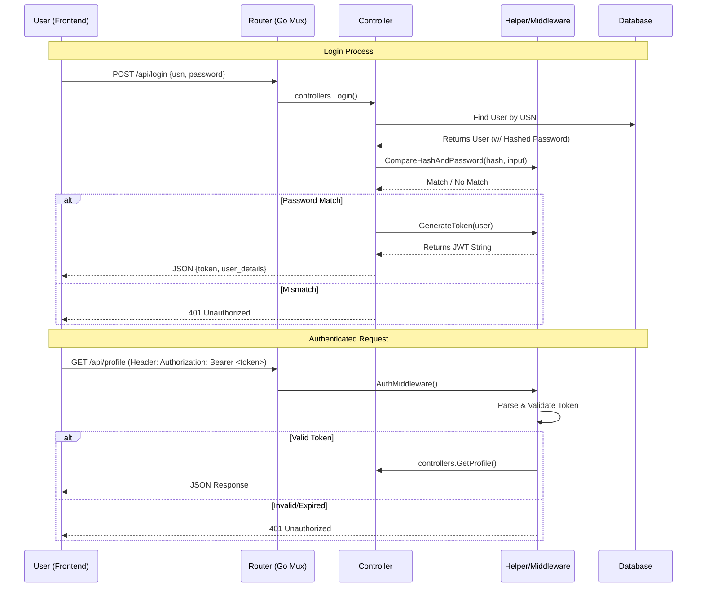

# JSS Rooms - Deep Dive: Authentication Flow

This document details the complete lifecycle of user authentication in JSS Rooms, from the initial frontend request to database storage and subsequent authenticated API calls.

## 1. Technologies Used
*   **Token Standard**: JWT (JSON Web Tokens)
*   **Signing Algorithm**: HS256 (HMAC with SHA-256)
*   **Password Security**: Bcrypt (Cost 14)
*   **Database**: PostgreSQL (via GORM)

---

## 2. High-Level Flow Chart



---

## 3. Detailed Step-by-Step

### Phase 1: Registration (`POST /api/register`)

1.  **Frontend**:
    *   `Register.jsx` collects `USN`, `Name`, `Password`, and optionally `Role`.
    *   Sends JSON payload to backend.

2.  **Backend (`controllers.Register`)**:
    *   **Input Validation**: Checks if USN/Password are empty.
    *   **User Check**: Queries DB to ensure USN doesn't already exist.
    *   **Password Hashing**: 
        *   Calls `helpers.HashPassword(input.Password)`.
        *   Uses `bcrypt.GenerateFromPassword` with a cost of 14. This makes it computationally expensive to brute-force.
    *   **DB Creation**: Saves the `User` struct with the *hashed* password.
    *   **Token Generation**:
        *   Calls `writeTokenResponse` (internal helper).
        *   Creates a JWT with claims: `id`, `usn`, `role`, and `exp` (24 hours).
        *   Signs it using the `JWT_SECRET` env variable.
    *   **Response**: Returns the Token and User object to the frontend.

### Phase 2: Login (`POST /api/login`)

1.  **Frontend**:
    *   `Login.jsx` collects `USN` and `Password`.
    *   Sends payload to `/api/login`.

2.  **Backend (`controllers.Login`)**:
    *   **User Lookup**: Finds the user record by USN.
    *   **Password Verification**:
        *   Calls `helpers.VerifyPassword(storedHash, inputPassword)`.
        *   This uses `bcrypt.CompareHashAndPassword`. It effectively re-hashes the input and checks if it matches the stored hash security.
    *   **Token Generation**: If verified, generates a new JWT (just like in registration).
    *   **Response**: Returns `{ token: "ey...", user: {...} }`.

### Phase 3: Storing the Session

1.  **Frontend**:
    *   Upon receiving the 200 OK response, the frontend extracts the `token`.
    *   It saves it to **LocalStorage**: `localStorage.setItem('token', response.data.token)`.
    *   It also saves basic user info (`localStorage.setItem('user', ...)`) for UI display (name/profile pic), updating app state context.

### Phase 4: Making Authenticated Requests

When the user accesses a protected page (e.g., Profile, or joining a Room):

1.  **Frontend Request**:
    *   Axios interceptors or manual calls retrieve the token from LocalStorage.
    *   The token is attached to the HTTP **Header**:
        ```http
        Authorization: Bearer <token_string>
        ```

2.  **Backend Middleware (`middleware.AuthMiddleware`)**:
    *   This wraps every protected handler function.
    *   **Extraction**: Reads the `Authorization` header and strips the "Bearer " prefix.
    *   **Validation**:
        *   Calls `helpers.ValidateToken(tokenString)`.
        *   Parses the token using the server's secret key.
        *   Checks the `exp` (expiration) claim to ensure the session is still valid.
    *   **Decision**:
        *   If valid: Calls `next.ServeHTTP(w, r)`, allowing the specific controller (e.g., `GetProfile`) to run.
        *   If invalid: Immediate `http.Error(w, "Unauthorized", 401)`. The controller is never reached.

---

## 4. Key Code Locations

| Component | File Path | Responsibility |
|-----------|-----------|----------------|
| **Controllers** | `backend/controllers/userController.go` | Logic for `Login` and `Register` handlers. |
| **Hashing** | `backend/helpers/helpers.go` | `HashPassword` and `VerifyPassword` implementation. |
| **Token Logic** | `backend/helpers/helpers.go` | JWT signing, parsing and validation logic. |
| **Middleware** | `backend/middleware/middleware.go` | `AuthMiddleware` function that intercepts requests. |
| **Routes** | `backend/routes/routes.go` | Maps `/api/login` to controller and wraps protected routes with middleware. |
| **DB Model** | `backend/models/models.go` | `User` struct definition (note: Password field has `json:"-"` so it's never sent back to frontend). |

## 5. Security Notes

*   **Secret Key**: The `JWT_SECRET` is crucial. It is loaded from `.env`. If lost, all existing tokens become invalid (users forced to log in again). If stolen, attackers can forge tokens.
*   **Password Safety**: We never store plain-text passwords. We only store the bcrypt hash. Even if the DB is leaked, the hashes are resistant to rainbow table attacks.
*   **Statelessness**: The backend does *not* store sessions in the database. The JWT itself is the proof of identity. This makes the backend highly scalable.
